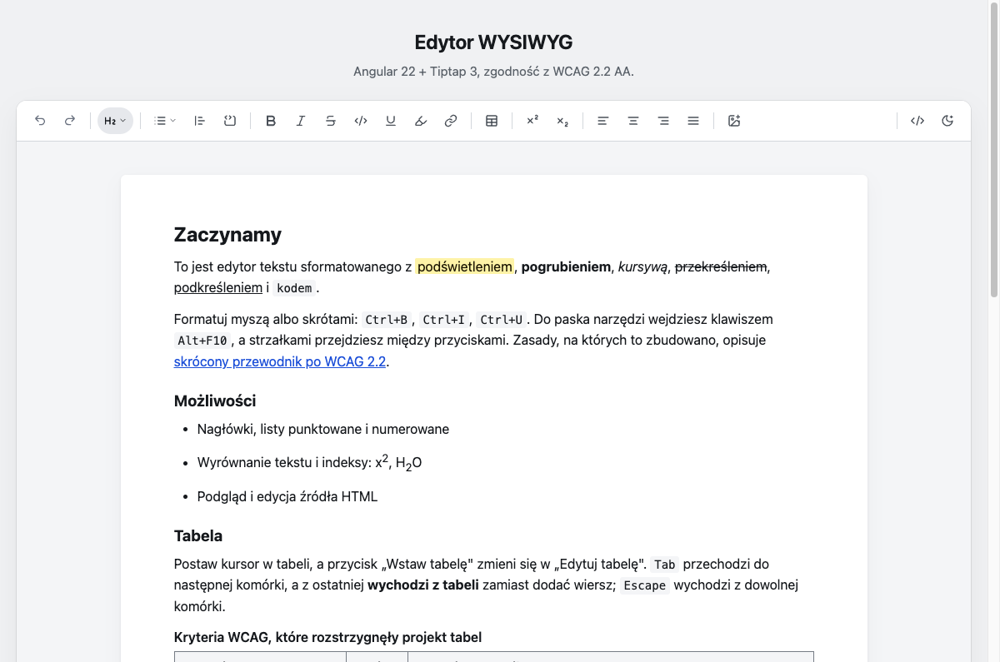
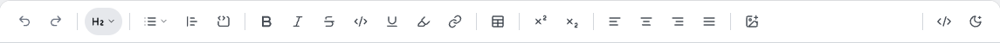
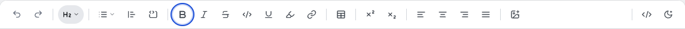
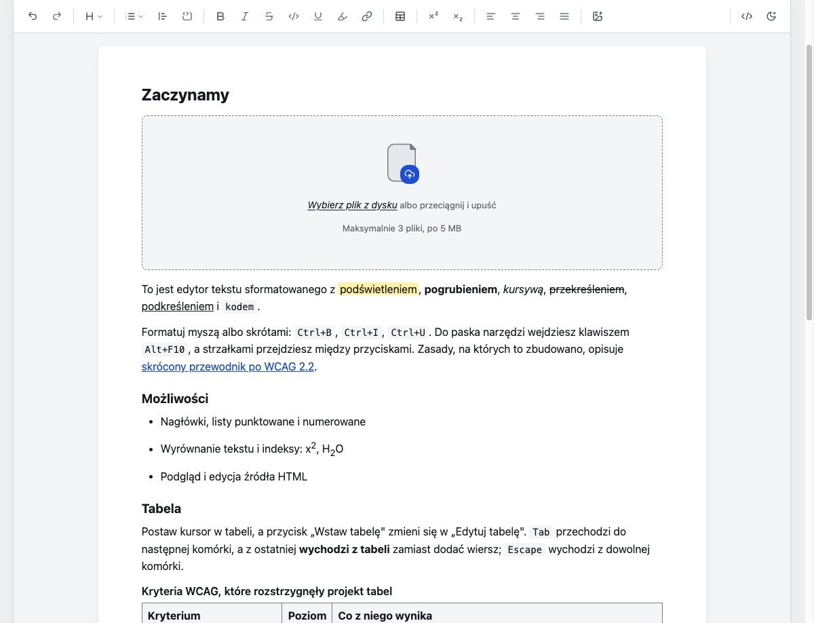
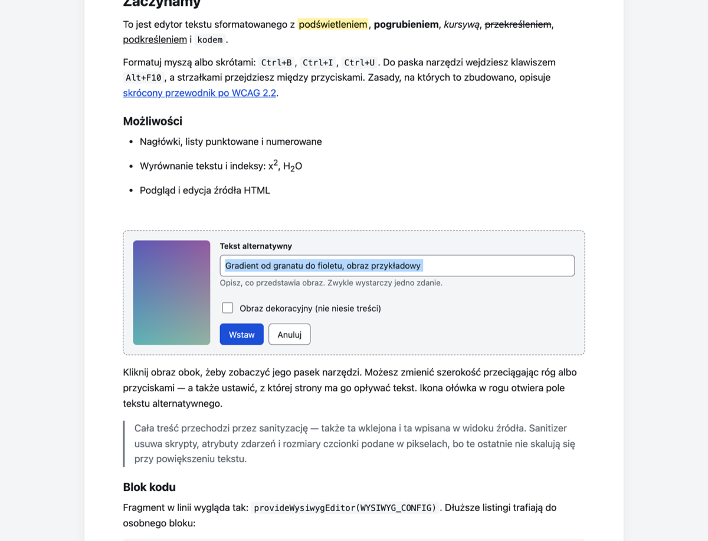
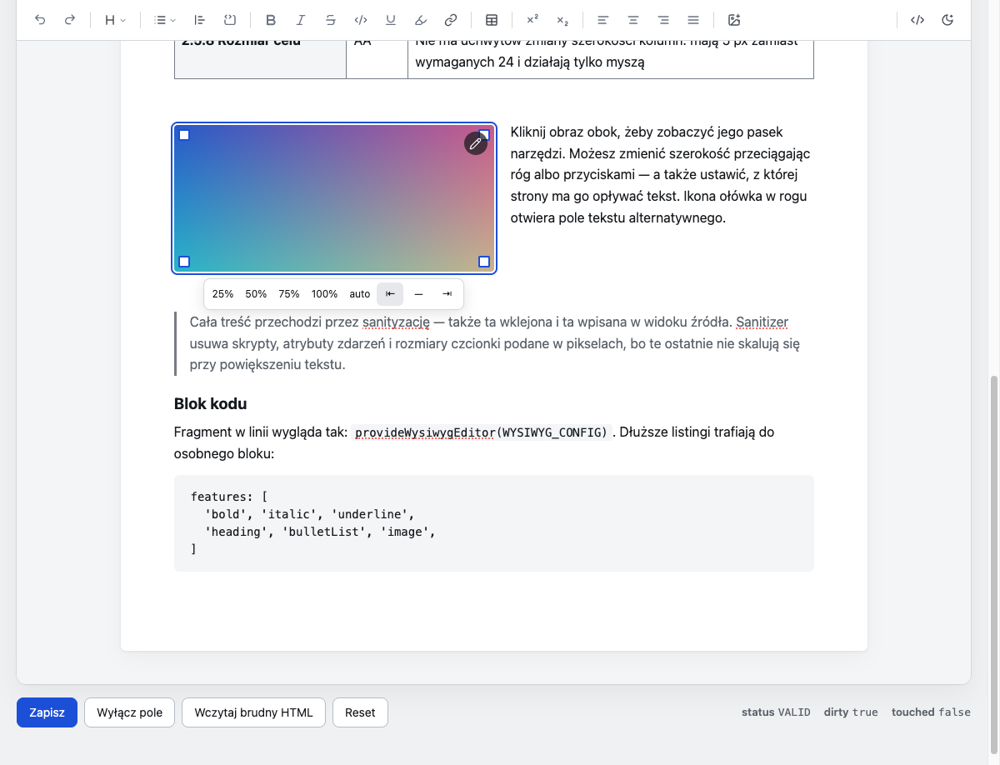
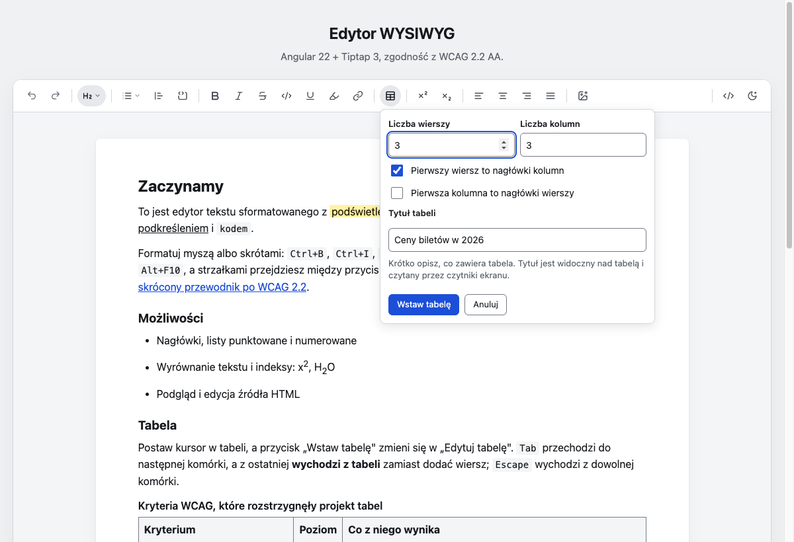
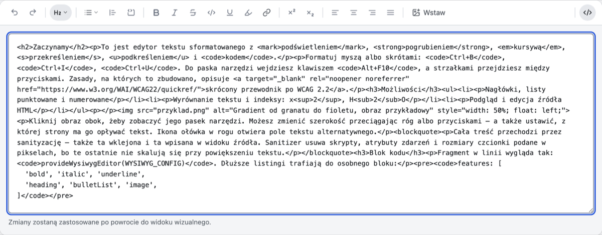
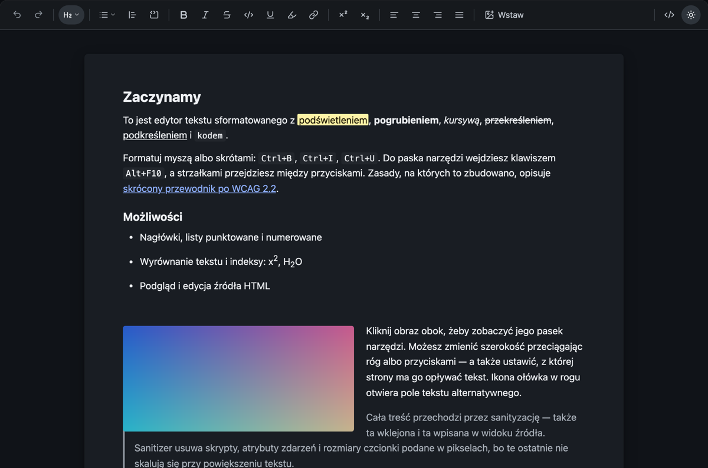

# wysiwyg-editor

Edytor tekstu sformatowanego dla Angulara, zbudowany na Tiptap 3, z dostępnością
traktowaną jako wymaganie, a nie dodatek. Celem jest **WCAG 2.2 na poziomie AA**.



## Dlaczego jeszcze jeden edytor

Większość gotowych edytorów produkuje treść, która nie przechodzi audytu dostępności:
obrazy bez tekstu alternatywnego, rozmiary czcionek w pikselach, paski narzędzi, po których
nie da się poruszać klawiaturą. Ten projekt rozstrzyga te sprawy w **modelu dokumentu**,
a nie atrybutami ARIA doklejanymi na końcu — jeśli schemat pozwala wyprodukować ``
bez `alt`, żadna ilość ARIA tego nie naprawi.

## Możliwości

| Obszar | Zakres |
|---|---|
| Formatowanie tekstu | pogrubienie, kursywa, podkreślenie, przekreślenie, kod, podświetlenie, odnośnik |
| Indeksy | górny i dolny |
| Bloki | nagłówki H1–H6, listy punktowane i numerowane, cytat, blok kodu |
| Układ | wyrównanie do lewej, wyśrodkowanie, do prawej, justowanie |
| Obrazy | wgrywanie, przeciągnij i upuść, zmiana rozmiaru, oblewanie tekstem, wymagany tekst alternatywny |
| Tabele | wstawianie o zadanej liczbie wierszy i kolumn, dodawanie i usuwanie wierszy i kolumn, nagłówki z wyliczanym `scope`, wymagany `<caption>`, wyjście z tabeli klawiaturą |
| Widok | przełącznik podglądu i edycji źródła HTML, przełącznik motywu jasny/ciemny |
| Integracja | `ControlValueAccessor`, czyli `formControlName` i `[(ngModel)]` |
| Bezpieczeństwo | sanityzacja na wejściu, przy wklejaniu, w widoku źródła i na wyjściu |

## Pasek narzędzi



Cały pasek to **jeden przystanek Tab** — wchodzisz w niego raz, a między przyciskami
poruszasz się strzałkami (wzorzec roving tabindex z APG). `Alt+F10` przenosi fokus z treści
na pasek, `Escape` wraca do treści.



Wyłączone przyciski **zostają** w kolejności nawigacji i dostają `aria-disabled` zamiast
atrybutu `disabled` — inaczej „Cofnij" znikałoby i wracało z paska, co dezorientuje.

## Instalacja

```bash
npm install wysiwyg-editor \
  @tiptap/core @tiptap/pm @tiptap/starter-kit \
  @tiptap/extension-highlight @tiptap/extension-superscript \
  @tiptap/extension-subscript @tiptap/extension-text-align \
  @tiptap/extension-image dompurify @angular/cdk
```

W stylach globalnych:

```css
@import 'wysiwyg-editor/styles/wysiwyg-editor.css';
```

> Ten import jest **obowiązkowy**, nie opcjonalny. Zawiera `@angular/cdk/a11y-prebuilt.css`,
> bez którego komunikaty dla czytników ekranu wyświetlają się jako widoczny tekst na stronie,
> oraz `@angular/cdk/overlay-prebuilt.css`, bez którego rozwijane menu są niepozycjonowane.

## Użycie

```html
<!-- Etykieta MUSI być zewnętrzna i powiązana przez aria-labelledby.
     <label for> NIE działa na div[contenteditable] — to nie jest element etykietowalny. -->
<h2 id="opis-label">Opis oferty</h2>
<p id="opis-hint">Maksymalnie 2000 znaków.</p>

<wysiwyg-editor
  formControlName="opis"
  aria-labelledby="opis-label"
  aria-describedby="opis-hint"
/>
```

W formularzach reaktywnych używaj `control.disable()`, a **nie** `[disabled]` na komponencie —
jednoczesne użycie obu daje ostrzeżenie Angulara i rozjazd stanu.

## Konfiguracja

Cała konfiguracja mieszka w jednym pliku: **[`projects/demo/src/app/wysiwyg.config.ts`](projects/demo/src/app/wysiwyg.config.ts)**,
podpiętym w `app.config.ts`:

```ts
import { provideWysiwygEditor } from 'wysiwyg-editor';
import { WYSIWYG_CONFIG } from './wysiwyg.config';

export const appConfig: ApplicationConfig = {
  providers: [provideWysiwygEditor(WYSIWYG_CONFIG)],
};
```

### Włączanie i wyłączanie przycisków

Pasek renderuje się **wyłącznie** z listy `features`. Usunięcie funkcji chowa jej kontrolkę
**i** nie rejestruje odpowiadającego rozszerzenia Tiptap, więc dany znacznik przestaje być
dopuszczany przez schemat. Dzięki temu nie da się doprowadzić do stanu, w którym treść
zawiera formatowanie, którego użytkownik nie może już zmienić.

```ts
features: [
  'undoRedo',
  'heading', 'bulletList', 'orderedList', 'blockquote', 'codeBlock',
  'bold', 'italic', 'strike', 'code', 'underline', 'highlight', 'link',
  'superscript', 'subscript',
  'textAlign',
  'image', 'table',
  'sourceView', 'themeToggle',
]
```

### Pozostałe opcje

| Opcja | Domyślnie | Znaczenie |
|---|---|---|
| `headingLevels` | `[1,2,3,4,5,6]` | Poziomy w menu nagłówków. Warto ograniczać — H1 zwykle należy do szablonu strony, nie do treści |
| `alignments` | wszystkie cztery | Zawężenie zestawu wyrównań; usunięcie wpisu chowa przycisk |
| `paperMaxWidth` | `44rem` | Szerokość kolumny treści. Podawaj w `rem` — w `px` przy powiększeniu 200 % zostaje kilka słów w wierszu |
| `theme` | `'system'` | Motyw początkowy: `system` (za `prefers-color-scheme`), `light` albo `dark`. Przycisk w pasku przełącza go w trakcie pracy |
| `stickyToolbar` | `false` | Pasek przyklejony przy przewijaniu |
| `enableInputRules` | `true` | Podstawienia: `- ` → lista, `# ` → nagłówek |
| `image.upload` | brak | `(file, signal) => Promise<{ src }>`. Bez tego zostaje tylko pole adresu URL |
| `image.maxFileBytes` | `5 MB` | Limit rozmiaru pojedynczego pliku |
| `image.allowBase64` | `false` | Osadzanie w treści jako `data:` — patrz ostrzeżenie niżej |
| `table.defaultRows` / `table.defaultCols` | `3` / `3` | Wartości początkowe w panelu wstawiania |
| `table.maxRows` / `table.maxCols` | `30` / `12` | Górny limit rozmiaru. To ograniczenie czytelności, nie wydajności — tabela szersza niż kilkanaście kolumn nie mieści się przy powiększeniu do 400 % |
| `table.withHeaderRow` / `table.withHeaderColumn` | `true` / `false` | Domyślny stan pól wyboru w panelu wstawiania |
| `table.requireCaption` | `true` | Blokuje wstawienie tabeli bez tytułu |
| `useTextboxRole` | `true` | `role="textbox"` na obszarze edycji |

### Wgrywanie obrazów

```ts
image: {
  upload: (file, signal) =>
    fetch('/api/upload', { method: 'POST', body: file, signal }).then((r) => r.json()),
}
```

> **Nie włączaj `allowBase64` bez potrzeby.** Plik 5 MB to ~6,85 mln znaków w jednym
> atrybucie `src`: sanitizer parsuje ten string przy każdej zmianie, autozapis wysyła go
> w całości przy każdej edycji, a kolumna w bazie puchnie.

## Obrazy



Kliknięcie „Wstaw obraz" wstawia kontener w miejscu kursora. Po wybraniu pliku pojawia się
podgląd i formularz opisu.



**Tekst alternatywny jest wymagany** albo trzeba jawnie zaznaczyć „obraz dekoracyjny".
Trzeciej drogi nie ma (SC 1.1.1). Pusty opis blokuje wstawienie, oznacza pole
`aria-invalid`, pokazuje komunikat i przenosi na nie fokus.



Kliknięcie obrazu pokazuje pasek: gotowe szerokości (25/50/75/100 %) i oblewanie tekstem.
Rozmiar zmienisz też przeciągając róg — ale **przeciąganie nie jest jedyną drogą**, bo samo
byłoby naruszeniem SC 2.1.1 (poziom A). Ikona ołówka otwiera ten sam formularz opisu,
z wypełnioną wartością (SC 3.3.7).

## Tabele



Przycisk „Wstaw tabelę" ma **własną sekcję paska, zaraz za stylem tekstu** — tabela nie
jest formatowaniem znaku ani wstawianym obiektem, tylko strukturą dokumentu. Otwiera panel
z **liczbą wierszy i kolumn**, wyborem nagłówków i polem tytułu. Kiedy kursor stoi w tabeli, ten sam przycisk nazywa się „Edytuj tabelę"
i pokazuje komendy: wiersz powyżej/poniżej, kolumna z lewej/z prawej, usuwanie, przełączniki
nagłówków (`aria-pressed`) oraz usunięcie tabeli. Panel **zostaje otwarty** po każdej
komendzie, więc kilka wierszy dodaje się jednym ciągiem.

Świadomie **nie ma popularnej siatki „najedź i wybierz 4×3"**: jej komórki mają około 16 px,
czyli poniżej progu SC 2.5.8 Target Size, a wybór rozmiaru zależy tam od precyzyjnego ruchu
wskaźnikiem. Pola liczbowe działają tak samo myszą, klawiaturą i sterowaniem głosem.

Przykładowa treść w demo zawiera gotową tabelę — możesz na niej od razu sprawdzić `Tab`,
`Escape` i przełączniki nagłówków, zamiast wstawiać własną.

Cztery rzeczy dzieją się bez udziału autora treści:

- **`scope` na każdym `<th>`** jest przeliczany po każdej zmianie dokumentu na podstawie
  POŁOŻENIA komórki w siatce (`col`, `row`, `colgroup`, `rowgroup`). Dodanie kolumny na
  początku zamienia „nagłówek wiersza" w zwykły nagłówek — atrybut podąża za zmianą.
  Bez tego czytnik ekranu czyta przy komórkach złe nagłówki albo żadnych (SC 1.3.1).
- **`<caption>` jest wymagany** (`table.requireCaption`) i trzymany jako **atrybut węzła**,
  a nie jego dziecko: `TableMap` zakłada, że każde dziecko `table` jest wierszem.
- **`Tab` w ostatniej komórce wychodzi z tabeli**, zamiast dodać wiersz jak w domyślnym
  keymapie Tiptapa. Tamto zachowanie jest pułapką klawiaturową (SC 2.1.2, poziom A) —
  użytkownik klawiatury nigdy nie opuściłby tabeli. `Escape` to druga droga wyjścia,
  z dowolnej komórki.
- **Zmiana szerokości kolumn myszą jest wyłączona.** Uchwyt ma 5 px (SC 2.5.8) i działa
  wyłącznie wskaźnikiem (SC 2.1.1). Tabela zwęża się razem z kolumną tekstu, a nadmiar
  przejmuje poziome przewijanie obszaru wokół niej — obszaru z `role="region"`,
  `aria-label` i `tabindex="0"`, bo obszar przewijalny musi być osiągalny z klawiatury.

## Widok źródła



Przełącznik działa jak „Source" w CKEditorze. Treść wpisana w tym widoku **też przechodzi
przez sanityzację** — pole tekstowe jest pełnoprawną drogą wejścia HTML.

## Motyw ciemny



Motyw ustawiasz w konfiguracji (`theme`), a użytkownik przełącza go **przyciskiem ze
słońcem i księżycem** po prawej stronie paska. Etykieta i ikona opisują motyw, który
zostanie włączony, a nie bieżący — odwrotna konwencja myli.

Atrybut `data-theme` trafia na host edytora **oraz** na kontener overlaya CDK. Ten drugi
wisi przy `<body>`, poza drzewem edytora, więc bez tego rozwijane menu i popovery zostawałyby
w poprzednim motywie.

Komponent emituje `themeChange`, dzięki czemu aplikacja może zsynchronizować resztę strony:

```html
<wysiwyg-editor formControlName="opis" (themeChange)="ustawMotywStrony($event)" />
```

Obsłużony jest także tryb wysokiego kontrastu (`forced-colors`) — ikony są rysowane
w `currentColor`, bo ikonofonty i tła graficzne w tym trybie znikają.

## Bezpieczeństwo

HTML przechodzi przez sanityzację na **czterech** drogach: `writeValue()`, wklejanie
(`transformPastedHTML`, przed parsowaniem do schematu), widok źródła i wyjście `getHTML()`.
Warstwy obrony: schemat ProseMirror (nie potrafi *reprezentować* `<script>`) → DOMPurify
z własną, izolowaną instancją → sanitizer aplikacji konsumującej.

Sanitizer nie tylko usuwa — **domyka też wymagania WCAG**: obraz bez `alt` dostaje `alt=""`,
a `<th>` bez `scope` dostaje `col` w pierwszym wierszu i `row` w każdym kolejnym. Przycisk
„Wczytaj brudny HTML" w demo pokazuje to na tabeli sklejonej ręcznie, bez żadnego `scope`.

Atrybut `style` jest filtrowany **deklaracja po deklaracji**, nie w całości. Jednym
mechanizmem odcina to `position: fixed` (clickjacking), `background: url()` oraz
`font-size` w pikselach — a to ostatnie egzekwuje SC 1.4.4 również na treści wklejanej
z Worda i Google Docs.

> HTML zwracany przez `valueChange` traktuj jako **niezaufany**, jeśli pochodzi od innego
> użytkownika. Sanityzacja po stronie przeglądarki jest wygodą dla autora treści, a nie
> granicą bezpieczeństwa.

## Dostępność — co jest zrobione

- `role="toolbar"` z grupami, roving tabindex, `Alt+F10`, `Escape`
- `aria-pressed` na przełącznikach; skrót w `aria-keyshortcuts`, **nigdy** w nazwie dostępnej
- Nazwa dostępna identyczna z tooltipem (SC 2.5.3 Label in Name)
- Brak skrótów jednoznakowych, więc SC 2.1.4 spełnione z definicji
- Ogłoszenia przez `LiveAnnouncer` **tylko** tam, gdzie technologia asystująca sama nie
  powie o zmianie — kliknięcie przełącznika w pasku nie jest ogłaszane, bo `aria-pressed`
  na sfokusowanym przycisku jest czytane natywnie
- Rozmiary celów ≥ 24×24 px (SC 2.5.8), na urządzeniach dotykowych 44×44
- `prefers-reduced-motion`, `forced-colors`, motyw ciemny
- Wyłączone pole usuwa treść z kolejności Tab (`inert`), łącznie z kontrolkami obrazu
- Tabele: wyliczany `scope`, wymagany `<caption>`, wyjście `Tab`/`Escape`, przewijalny
  obszar z `role="region"` i `tabindex="0"`

## Czego automat nie sprawdzi

`axe` wykrywa mniej więcej **30 %** problemów. Reszta wymaga człowieka. Najważniejsze:

1. NVDA i JAWS: czy w obszarze edycji działają klawisze `H`, `L`, `T`
2. VoiceOver: czy rotor pokazuje strukturę **wewnątrz** edytora
3. **Firefox „Powiększaj tylko tekst" na 200 %** — to jedyny test, który wykrywa rozmiary
   w pikselach; zoom całej strony je maskuje
4. Kontrast zmierzony przyrządem dla stanów: zwykły, najechany, wciśnięty, sfokusowany,
   wyłączony — w obu motywach
5. Przejście pełnego zadania samą klawiaturą

## Rozwój

```bash
npm start          # serwer demo na http://localhost:4200
npm run build      # budowanie biblioteki
npm test           # testy jednostkowe (Vitest)
npm run e2e        # testy end-to-end (Playwright)
```

Wymaga Node zgodnego z `.nvmrc` (linia 24.x) — Angular 22 wymaga co najmniej `24.15.0`.

## Znane ograniczenia

- W tabelach nie ma scalania i dzielenia komórek ani zmiany szerokości kolumn. Scalanie
  komplikuje nawigację czytnikiem na tyle, że wymaga osobnego projektu obsługi; szerokości
  wymagałyby drogi innej niż przeciąganie (SC 2.1.1, SC 2.5.8).
- Świeżo wstawiona tabela ma puste komórki nagłówkowe, więc `axe` zgłasza wtedy
  `empty-table-header` (poziom „minor"). Znika po wpisaniu nagłówków.
- Adresy `blob:` z podglądu wgrywania żyją tylko w bieżącej sesji przeglądarki. Przed
  zapisem treści zastąp je trwałym URL-em ze swojego magazynu plików.
- Wyszukiwanie i zamiana nie są dostępne — Tiptap oferuje je wyłącznie w płatnym Pro.

## Licencja

MIT. Ikony paska pochodzą z [tiptap-ui-components](https://github.com/ueberdosis/tiptap-ui-components)
(MIT, © 2025 Tiptap).
